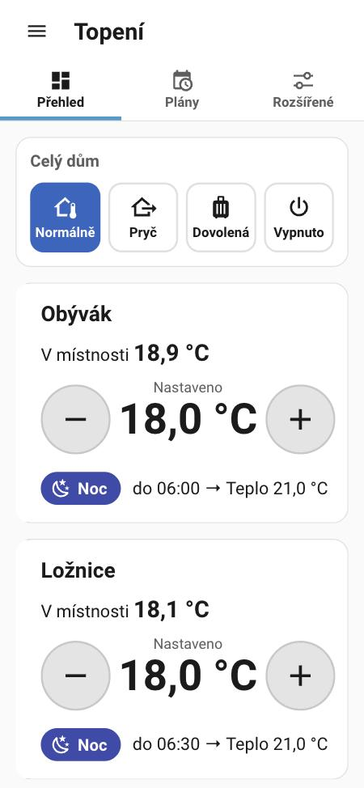
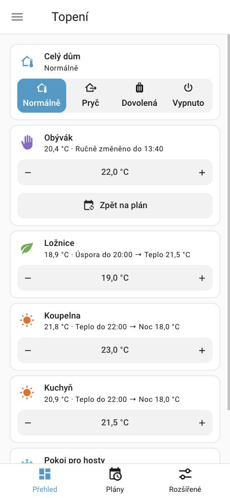
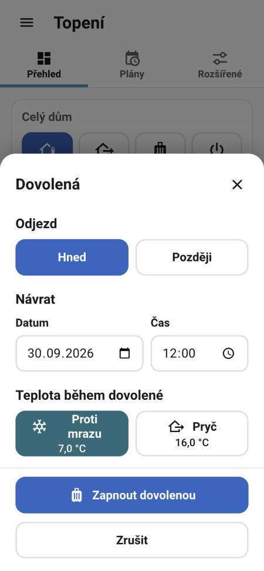
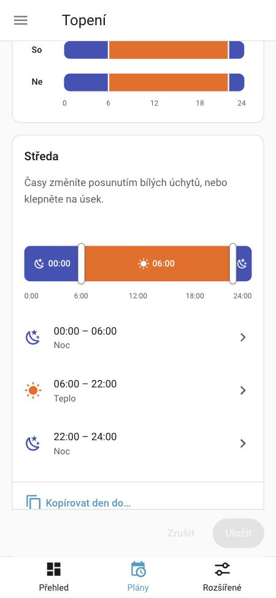

# Heating Scheduler

A Home Assistant integration that decides the target temperature of every room and keeps
every radiator valve (TRV) in the room at that temperature. It has a simple sidebar panel
for phones and tablets, and a Lovelace card.

<p>
  
  
  
  
</p>

- Weekly plans with modes: Warm, Saving, Night, Away, Frost guard, Off.
- Rooms share plans and temperature sets, so you set them once.
- House modes: Normal, Away, Holiday (planned in advance), Frost guard, Off. For the whole
  house, or per zone: for example, the first floor is away and the ground floor heats as usual.
  Each zone offers only the modes it needs.
- **Boost**: one tap heats every room, one zone or one room at its valves' maximum for a set
  time (default 1 h), for example when you come back from a holiday.
- Manual changes on the valve knob or in the app last until the next change of the plan.
- The integration **reconciles** instead of firing actions at fixed times: after a restart,
  a missed timer or a valve that was offline for hours, every valve gets the right value.
- Writes are verified and retried; our own confirmations are never taken for manual changes.
- Czech and English. No cloud.

Boiler control, valve positions and temperature sensors of the valves are not touched.

## Requirements

- Home Assistant 2026.9 or newer.
- Radiator valves as `climate` entities. Tested with Sonoff TRVZB through Zigbee2MQTT.
- The panel and the card are built from Home Assistant's own components and look like the
  rest of Home Assistant. HA changes these components between releases, so after an HA
  update the panel may need a new release of this integration.
- Temperatures in the panel, plans, temperature sets and services are always °C. Home
  Assistant itself may use °C or °F; the valves always get the right value.

## Installation

### HACS

1. HACS → ⋮ → **Custom repositories** → add
   `https://github.com/JiriBalcar/ha-heating-scheduler`, type **Integration**.
2. Install **Heating Scheduler** and restart Home Assistant.

### Manual

Copy `custom_components/heating_scheduler` to `config/custom_components/` and restart
Home Assistant.

## Setup

1. **Settings → Devices & services → Add integration → Heating Scheduler.**
2. Open **Heating Scheduler** in the sidebar.
3. **Advanced → Rooms → Add rooms from areas** creates one room per Home Assistant area that
   has valves. You can also add rooms by hand and pick their valves.
4. Optional: choose a **Temperature shown** sensor per room. It is used only for display.
5. **Plans**: change the house plan, or give some rooms their own plan.
6. **Temperatures**: the house temperatures, and own sets for rooms that need
   other values (for example a warmer bathroom).
7. Optional: **Advanced → Zones** divides the house into zones with their own mode and
   holiday, for example floors. **Create zones from floors** puts each room in a zone named
   after its Home Assistant floor: the floor of the room's area, or else of its valve's area.
   **Modes** in a zone's menu chooses the modes the zone offers, and what the zone does
   instead of each mode it leaves out.

**First start:** turn on **Advanced → Settings → Test mode**. The integration then computes
and logs everything but sends nothing to the valves. Check **Advanced → Log**, then turn
test mode off.

### Sonoff TRVZB (Zigbee2MQTT) checklist

- Do not use the valve's own weekly schedule. The integration always sets HVAC mode `heat`
  (on the TRVZB, `auto` runs the internal schedule).
- Keep your automation that sends the room temperature to the valve
  (`external_temperature_input`). This integration does not touch it.
- Keep the valve's frost protection temperature below the **Frost guard** temperature.
- Enable Zigbee2MQTT **availability** so that offline valves are reported.

## Návod pro každý den (česky)

**Co vidím.** Každá místnost má svou dlaždici:

- Pod názvem je teplota v místnosti a co se děje teď a potom, například
  „20,4 °C · Teplo do 22:00 → Noc 18,0 °C“.
- Číslo mezi **−** a **+** je teplota, kterou má místnost mít.
- Barevná ikona vlevo ukazuje režim: **Teplo**, **Úspora**, **Noc**, **Pryč**,
  **Proti mrazu**, **Vypnuto** nebo **Ručně**.

**Chci tepleji nebo chladněji.** Klepněte na **+** nebo **−**. Každé klepnutí je půl stupně.
Změna platí do další změny v plánu. Dlaždice má pak fialovou ikonu ruky a text
**Ručně změněno**. Tlačítko **Zpět na plán** změnu hned zruší.

**Otočil jsem kolečkem na hlavici.** To je totéž jako **+** nebo **−**. Ostatní hlavice
v místnosti se nastaví stejně. Po další změně v plánu se vše vrátí samo.

**Odcházím nebo odjíždím.** Nahoře je dlaždice **Celý dům**:

- **Pryč**: krátká nepřítomnost. Všechny místnosti budou na teplotě Pryč.
  Po návratu klepněte na **Jsem doma — Normálně**.
- **Dovolená**: vyberte, kdy se vrátíte. Dům bude jen chráněný proti mrazu.
  V den návratu se topení vrátí samo, nic nemusíte dělat.
- **Vypnuto**: topení je vypnuté (léto).
- **Normálně**: topí se podle plánu.

Klepnutím na dlaždici se otevře okno s velkými tlačítky a s tím, co se teď děje. Nad
dlaždicemi se ukáže připomínka s tlačítkem **Jsem doma — Normálně**. Když dovolená běží
a chcete změnit den návratu, klepněte znovu na **Dovolená**.

**Každé patro zvlášť.** Když je dům rozdělený na zóny (například patra), má každá zóna svou
dlaždici nad svými místnostmi. Režim zóny platí jen pro její místnosti: **1. patro** může
být **Pryč** a přízemí topí dál podle plánu. Dlaždice **Celý dům** přepne všechny zóny
najednou. Když mají zóny různé režimy, ukazuje **Různě** a vypíše režim každé zóny.

Během režimů Pryč, Dovolená a Vypnuto nejde teplota v místnosti měnit. Nejdřív přepněte dům
(nebo jeho zónu) na **Normálně**.

**Přijel jsem a doma je zima.** Klepněte na dlaždici **Zatopit naplno** a potvrďte. Všechny
místnosti topí naplno (hlavice na maximum), obvykle 1 hodinu. Potom se samy vrátí k plánu.
Když byl dům Pryč, na dovolené nebo vypnutý, přepne se na **Normálně**. Během zatápění naplno
nejde teplota v místnosti měnit. Tlačítko **Ukončit** zatápění ukončí hned. Délku změníte
v **Rozšířené → Nastavení**. Jen jednu místnost zatopíte naplno předvolbou **Naplno** jejího
termostatu, jen jedno patro jeho vypínačem **Zatopit naplno** (například v dlaždici na
nástěnce).

**Problém s hlavicí**: na ikoně místnosti je oranžový vykřičník, pod názvem místnosti je
napsané, co se děje (například „Hlavice neodpovídá“), a nahoře se ukáže upozornění.
Klepněte na ikonu, uvidíte vysvětlení. Nejčastěji jde o vybité baterie.

**Změna plánu.** Otevřete **Plány**, u plánu klepněte na **Změnit plán** a pak na den.
Časy změníte posunutím bílých úchytů nebo klepnutím na úsek. **Kopírovat den do…**
zkopíruje den na jiné dny. Nakonec klepněte na **Uložit**. Když odejdete bez uložení,
aplikace se zeptá, jestli změny zahodit.

**Větší písmo.** V nastavení aplikace Home Assistant nastavte **Page zoom** (přiblížení
stránky), například na 125 %. Zvětší se celá aplikace.

## Everyday guide (English)

- Each room is a tile: the temperature in the room and what happens now and next
  ("20.4 °C · Warm until 22:00 → Night 18.0 °C"), the temperature it is **set to** between
  **−** and **+**, and a coloured icon for the mode.
- **+** and **−** change the room by half a degree until the next change of the plan.
  **Back to plan** ends the change at once. Turning the knob on a valve does the same.
- **Whole house**: **Away** for short absences (press **I'm home — Normal** when back),
  **Holiday** with a return date (heating comes back by itself), **Frost guard** for a house
  left empty with no return date (every room at the Frost guard temperature), **Off** for
  summer, **Normal** to follow the plans. In Away, Holiday, Frost guard and Off, room
  temperatures are fixed.
  Tap the tile for a dialog with big buttons. A reminder with **I'm home — Normal** shows
  above the tiles. To change the return date of a running holiday, tap **Holiday** again.
- **Zones** (for example floors): each zone has its own tile above its rooms, and its mode
  applies only to its rooms. **Whole house** switches every zone; while the zones differ,
  it shows **Mixed** and lists the mode of each. A zone can leave out modes: when the whole
  house gets such a mode, the zone does its replacement, for example the first floor stays
  Normal while the house is Away. For a holiday of the whole house, the replacement runs for
  the holiday's dates. A zone in a mode it stops offering switches to the replacement.
- **Boost**: tap the **Boost** tile and confirm. Every room heats at its valves' maximum for
  the time set in **Advanced → Settings** (default 1 h), then the plans continue. A boost
  switches Away, Holiday, Frost guard and Off to Normal. During a boost, room temperatures are fixed.
  **Stop** ends it early. One room boosts with its thermostat's preset **Boost**, one zone
  with its **Boost** switch (for example in a tile on a dashboard).
- A **valve problem** shows as an orange exclamation mark on the room's icon, in words under
  the room's name ("A valve does not respond"), and in an alert above the tiles; tap the icon
  for an explanation.
- **Plans**: tap **Change plan** and a day, drag the white handles or tap a part, then
  **Save**. Leaving with unsaved changes asks first.
- **Larger text**: set **Page zoom** in the Companion app settings, for example to 125 %.

## How it works

For every room the integration computes the target with a pure function:

1. The mode of the room's zone wins: **Off**, **Frost guard**, **Holiday** or **Away**.
   Without zones, the whole house is one zone.
2. Otherwise a **boost** wins: every room at the highest temperature its valves allow, until
   the boost ends.
3. Otherwise a **manual change** (from a valve knob, the app, a service or voice) wins until
   the next change of the plan, and at most the longest manual change (default 4 h).
4. Otherwise the room's **plan** decides, with the room's temperatures.

It then brings every valve to that value. It recomputes on start, at the next change of
any room, on every change of settings, every 5 minutes, and when a valve comes back online.
Values are rounded to the valve's step and limited to its range. Each write is confirmed by
the valve; lost commands are sent again (after 30, 60 and 120 seconds). DST changes are
handled: a plan time that does not exist is used at the end of the gap, a time that occurs
twice is used once.

A change of a zone's mode ends the manual changes in that zone. When a holiday ends, the zone
returns to the mode it had when the holiday started. A zone without Holiday runs its replacement
for the holiday's dates, then returns the same way.

The whole house, each zone and each room have boosts of their own; a room heats at full while
any of them covers it, and stopping one leaves the others running. A boost of the house or of a
zone switches those zones to Normal; a room boosts only while its zone is Normal. A zone that
leaves Normal (Away, Frost guard, Off, or a holiday, also a planned one that starts) ends its
own boost and its rooms' boosts; the house's boost ends once no zone is Normal. During a boost,
a turn of a valve knob is undone, and a room under the boost of its zone or the house takes no
changes.

## Entities

Entity ids depend on the Home Assistant language; English names are shown.

| Entity | Per | Purpose |
|---|---|---|
| `climate.<room>` | room | Room thermostat for voice assistants and thermostat cards. `auto` = plan, `heat` = manual change or boost, `off` = off. The preset is the mode; a manual change shows the mode with its temperature, or Manual; a boost shows Boost. The preset Boost starts the room's own boost; another preset or `auto` ends it. Attribute `status`: the room's state in words ("Warm until 22:00 → Night 18.0 °C"), for a tile card's `state_content`. |
| `sensor.<room>_heating_mode` | room | Current mode; attributes: target temperature, reason, until, next mode, manual change. |
| `button.<room>_back_to_plan` | room | Ends a manual change. |
| `binary_sensor.<room>_heating_problem` | room | On when a valve is offline, a write failed or a wrong value persists. |
| `select.heating_house_mode` | house | Normal (`auto`), Away, Holiday (`vacation`), Frost guard (`frost`), Off for every zone; a zone without the mode gets its replacement. Mixed (`mixed`) while the zones have different modes; it cannot be selected, and the attribute `zones` shows the mode of each. |
| `select.heating_mode_<zone>` | zone | The mode of one zone, among the modes it offers. Only when there are two or more zones. |
| `switch.heating_boost` | house | On while the house's boost runs. On starts a boost for the length in the settings; off ends it. Attributes: `until`, `duration_minutes`. |
| `switch.heating_boost_<zone>` | zone | The same for one zone. Only when there are two or more zones. |
| `number.heating_temperature_*` | house | House temperatures of Warm, Saving, Night, Away, Frost guard. |

Tip: hide the valves themselves from voice assistants and use the room thermostats.

## Services

| Service | Data |
|---|---|
| `heating_scheduler.set_override` | target: room thermostat; `temperature`; optional `duration` or `until` |
| `heating_scheduler.clear_override` | target: room thermostat |
| `heating_scheduler.set_house_mode` | `mode`: `auto`, `away`, `vacation`, `frost`, `off`; optional `zone` |
| `heating_scheduler.set_vacation` | optional `start`, `end`, `mode` (`frost` or `away`), `zone` |
| `heating_scheduler.cancel_vacation` | optional `zone` |
| `heating_scheduler.boost` | optional `duration`, 15 minutes to 4 hours (default: the setting); optional `zone`. To end a boost, turn off its switch. One room: `climate.set_preset_mode` with `boost`. |
| `heating_scheduler.reconcile_now` | — |

`zone` is the name of a zone (in any case) or its id. Without it, the action applies to every
zone.

Example: warm the bathroom for an hour.

```yaml
action: heating_scheduler.set_override
target:
  entity_id: climate.bathroom
data:
  temperature: 23.5
  duration: "01:00:00"
```

Example: a holiday on the first floor only, from now until 17 October, 18:00.

```yaml
action: heating_scheduler.set_vacation
data:
  zone: "1. patro"
  end: "2026-10-17 18:00:00"
```

Example: heat every room at full power for 2 hours.

```yaml
action: heating_scheduler.boost
data:
  duration: "02:00:00"
```

## Lovelace card

The card switches the mode of the whole house or of one zone (Normal, Away, Holiday, Frost
guard, Off; a zone's tile only the modes the zone offers), as a tile of Home Assistant's own size. It is loaded automatically. Add **Heating Scheduler** from the
card picker, or:

```yaml
type: custom:heating-scheduler-card
zone: zone_1a2b3c4d   # optional: the zone's tile; without it, the whole house
```

A tap on the tile opens a dialog like the one of an alarm panel. In a sections view the tile takes
two rows, like Home Assistant's tile card with one feature. The reminders (back to Normal, a
planned holiday) show above the tile only where the card can grow: in other views, or with rows
set to "auto".

Rooms and boosts use Home Assistant's own tile cards. The room thermostat's `status` shows what
the room does and until when, as in the panel:

```yaml
type: tile
entity: climate.living_room
state_content:
  - current_temperature
  - status
features:
  - type: target-temperature
  - type: climate-preset-modes
    style: icons
```

```yaml
type: tile
entity: switch.heating_boost   # or the switch of one zone
features:
  - type: toggle
```

A dashboard shows "Custom element doesn't exist: heating-scheduler-card" when the page was opened
before the integration was installed. Reload the page (in the Home Assistant app: close the app
completely and open it again), or open **Heating Scheduler** in the sidebar once.

## Development

```bash
uv sync --python 3.14
```

```bash
uv run pytest --cov
```

```bash
uv run ruff check . && uv run mypy
```

```bash
cd frontend && npm ci && npm run check
```

`npm run check` type-checks, runs the frontend tests and builds the bundles into
`custom_components/heating_scheduler/dist/` (committed, so HACS needs no build step):
`heating-scheduler-panel.js` holds the panel and the card, and `heating-scheduler-card.js`
is the small loader that Home Assistant loads on start.

A local instance with simulated valves lives in `dev/`:

```bash
uv run python dev/seed.py
```

```bash
uv run hass -c dev/config
```

The action `fake_trv.set_offline` (`entity_id`, `offline`) takes a simulated valve offline,
to see how problems are shown.

Design notes: [docs/architecture.md](docs/architecture.md). Original specification:
[docs/spec.md](docs/spec.md).

## License

MIT
